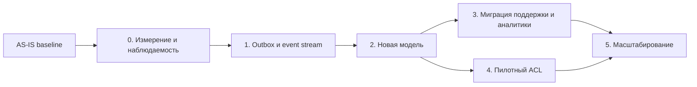

# Дорожная карта инкрементальной миграции RetailCore

## 0. Паспорт дорожной карты

| Поле | Значение |
|---|---|
| Название проекта | Управляемая миграция RetailCore |
| Связанный документ трансформации | [Трансформация и целевая архитектура первого этапа](../task3/transformation.md) |
| Горизонт планирования | Первый управляемый этап трансформации |
| Стратегия миграции | Инкрементальная миграция с параллельным запуском |
| Ключевые паттерны | Strangler Fig, Transactional Outbox, Event-Driven, ACL, Read Model |

## 1. Краткое резюме

Миграция выполняется инкрементально, так как RetailCore не может позволить себе окно остановки, а монолит и Oracle остаются критичными для процесса заказа. Сначала фиксируются эталонные данные и реестр зависимостей, затем вводятся correlation id и измеримость. После этого добавляется outbox/event stream без смены владельца `createOrder`, запускается read model и выполняется сверка со старой картиной Oracle. Только после подтверждения качества данных поддержка и часть аналитики переводятся на новый источник. Интеграционный ACL подключается пилотно для ограниченного логистического сценария, чтобы не менять всю маршрутизацию сразу.

## 2. Стартовое и целевое состояние

| Состояние | Описание | Ключевые ограничения | Признаки состояния |
|---|---|---|---|
| AS-IS | Монолит оркестрирует заказ. Oracle хранит данные и логику. Поддержка и аналитика собирают картину из разных источников. | Высокая связность, слабая наблюдаемость, прямые SQL к Oracle. | Эталоны для инцидентов, ручных эскалаций и Oracle-нагрузки ещё требуют описания. |
| Промежуточное 1 | Есть correlation id, реестр статусов, зависимостей Oracle и потребителей данных. | Бизнес-логика не изменена. | Можно трассировать пилотные заказы. |
| Промежуточное 2 | Outbox и поток событий публикуют события заказа в параллельном режиме. | Монолит остается владельцем создания заказа. | События сверяются с Oracle. |
| Промежуточное 3 | Read model используется поддержкой и пилотными отчётами после сверки. | Старые источники сохраняются для возможного отката. | Снижается ручной поиск и прямые чтения по пилотному объему. |
| TO-BE первого этапа | Прозрачный контур событий, read model, наблюдаемость и пилотный ACL логистики работают без остановки ядра заказов. | Oracle и монолит остаются, полный процесс заказа не вынесен. | Метрики качества данных и операционного эффекта контролируются регулярно. |

## 3. Принципы дорожной карты

- Сначала измеряем, потом меняем: до миграции нужны эталоны по статусам, ручным эскалациям, расхождениям и нагрузке на Oracle.
- Сначала прозрачность, потом декомпозиция: события, read model и наблюдаемость предшествуют выносу бизнес-логики.
- Сначала параллельный запуск, потом переключение: новый источник не становится основным до сверки.
- Сначала ограниченный пилот, потом масштабирование: ACL начинается с одного безопасного логистического сценария.
- Сначала владельцы данных, потом новые витрины: канонические определения статуса, отмены, скидки и возврата должны быть согласованы.

## 4. Дорожная карта миграции

| Этап | Цель | Промежуточное состояние | Основные работы | Зависимости | Риски | Критерии завершения |
|---|---|---|---|---|---|---|
| Аудит | Зафиксировать стартовую точку. | Понятны текущие потоки и основные пробелы. | Собрать карты статусов, интеграций, Oracle-потребителей, ручных операций. | Интервью и доступ к логам/схемам. | Неполная картина скрытых зависимостей. | Реестр подтвержден командами заказов, логистики, аналитики и поддержки. |
| 0. Измерение и наблюдаемость | Сделать пилотные заказы трассируемыми. | Correlation id и базовые дашборды для жизненного цикла заказа. | Добавить correlation id, определить логи, метрики, алерты, эталонные значения. | Аудит. | Рост объема логов, неполное покрытие legacy. | Пилотный заказ можно проследить через монолит, Oracle, интеграции и новую систему. |
| 1. Outbox и event stream | Обеспечить надёжную отправку данных. | События пишутся рядом с транзакцией заказа. | Ввести outbox, минимальный контракт событий, идемпотентный ключ. | Этап 0, согласованный контракт событий. | Влияние на транзакции Oracle. | События публикуются в параллельном режиме и не ухудшают процесс заказа по согласованным метрикам. |
| 2. Новая модель | Построить единую историю заказа для сверки. | Read model наполняется, но не является основным источником. | Собрать статусы, причины отклонений, источники; запустить сверки с Oracle. | Этап 1. | Расхождения с legacy-источниками. | Расхождения классифицированы, правила трактовки согласованы. |
| 3. Миграция поддержки и пилотной аналитики | Перевести ограниченных потребителей на новую модель. | Поддержка и пилотные отчеты используют новый источник с возможностью отката. | Выполнить план миграции, оставить старые источники доступными, контролировать метрики. | Этап 2, готовность поддержки. | Потеря доверия при расхождениях. | Пользователи подтверждают достаточность данных, откат не потребовался. |
| 4. Пилотный ACL | Изолировать одну партнерскую интеграцию. | Один сценарий работает через ACL с единым контрактом статуса. | Реализовать идемпотентность, повторы, маппинг статусов, события доставки. | Этапы 0-2, выбор пилотного партнера. | Дубли заявок, задержки подтверждений. | Дубли и ошибки повторных запросов контролируются, статусы попадают в новую модель. |
| 5. Масштабирование | Расширить новый контур на новые сценарии. | Больше потребителей читают события из новой модели, больше интеграций ACL. | Перевести следующие отчёты и партнеров, снизить прямые SQL к Oracle. | Успешные этапы 3-4. | Слишком быстрое расширение без качества данных. | Для каждого расширения есть эталон, сверка, план отката. |

## 5. Зависимости между этапами

| Зависимость | Почему порядок жесткий | Что будет, если нарушить | Контроль |
|---|---|---|---|
| Эталон до наблюдаемости | Нужна стартовая точка для эффекта. | Нельзя доказать улучшение. | Подтверждение реестров командами. |
| Наблюдаемость до миграции | Нужно видеть поведение нового и старого контуров. | Миграция станет непрозрачной. | Дашборды и трассировка пилотных заказов. |
| Outbox до новой модели | Новая модель должна иметь надёжный источник событий. | Появится ещё одна несогласованная витрина. | Контракт событий и сверка. |
| Параллельная работа до миграции | Нужно проверить качество данных. | Поддержка получит неполную картину. | Параллельный запуск и классификация расхождений. |
| Новая модель до расширения ACL | Статусы доставки должны быть видны в единой истории. | Новые интеграции добавят непрозрачность. | События ACL попадают в новую модель. |

## 6. Управление рисками

| Этап | Риск | Вероятность | Влияние | Контроль | Условие остановки | Владелец |
|---|---|---|---|---|---|---|
| 0 | Correlation id покрывает не все legacy-ветки. | Средняя | Среднее | Пилотные трассировки и список непокрытых веток. | Нельзя проследить выбранный пилотный сценарий. | Эксплуатация, техлид |
| 1 | Outbox ухудшает транзакции Oracle. | Средняя | Высокое | Нагрузочные проверки и мониторинг БД. | Деградация процесса заказа сверх согласованного порога. | Техлид, DBA |
| 2 | Новая модель расходится со статусами Oracle. | Высокая | Высокое | Ежедневная сверка и классификация причин. | Неклассифицированные расхождения по критичным статусам. | Аналитика, заказы |
| 3 | Поддержке не хватает данных в новом интерфейсе. | Средняя | Среднее | Пилот с ограниченной группой операторов. | Рост эскалаций или невозможность ответить по пилотным заказам. | Поддержка |
| 4 | ACL создает дубли или задержки доставки. | Средняя | Высокое | Идемпотентность, политика повторов, мониторинг статусов. | Дубли заявок или потеря подтверждений. | Логистика |

## 7. Метрики и контрольные точки

| Контрольная точка | Когда проверяем | Что проверяем | Целевой порог | Источник | Решение |
|---|---|---|---|---|---|
| Эталон подтвержден | Конец AS-IS этапа | Карта статусов, Oracle-потребителей, ручных операций. | Число не задано; требуется подтверждение владельцев. | Документы и интервью | Продолжить / уточнить |
| Трассировка пилота | Конец этапа 0 | Возможность восстановить путь заказа. | Требует согласования. | Логи, дашборды | Продолжить / расширить покрытие |
| События корректны | Конец этапа 1 | События соответствуют Oracle и потоку заказа. | Требует согласования. | Поток событий, сверка | Продолжить / исправить контракт |
| Новая модель готова | Конец этапа 2 | Полнота истории и расхождения. | Требует согласования. | Сверочные отчеты | Миграция / продолжить параллельную работу |
| Миграция стабильна | После этапа 3 | Эскалации, расхождения, обращения поддержки. | Требует согласования. | CRM, новая модель, Oracle | Закрепить / откатить |

## 8. Открытые вопросы

| Вопрос | Почему важен | Кто должен ответить | Что делаем, если ответа нет |
|---|---|---|---|
| Какие SLA/SLO и RTO/RPO применимы к процессу заказа, статусам, оплате и доставке? | Нужны для миграции и плана отката. | Бизнес, эксплуатация, владельцы доменов. | Не задаем численные пороги, используем качественные условия остановки. |
| Какие статусы являются клиентскими, внутренними и техническими? | Нужны для новой модели и коммуникации. | Заказы, поддержка, логистика. | Не переключаем поддержку на новый источник. |
| Какие отчеты аналитики первыми переводить с Oracle? | Нужен безопасный пилот с измеримым эффектом. | Аналитика, бизнес-пользователи. | Оставляем аналитику на старой сверке. |
| Какой партнер подходит для ACL-пилота? | Нужна ограниченная зона риска. | Логистика. | ACL не переводится в промышленную эксплуатацию. |
